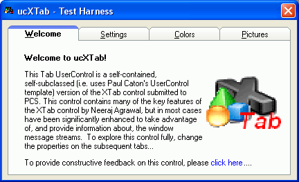



## ucXTab \- Graphical Tab UserControl

### Description

ucXTab UserControl is a self-contained (single file), self-subclassed (uses Paul Caton&#8217;s subclassing thunk) version of the XTab control submitted to PCS by Neeraj Agrawal. This control contains all of the key features of the original XTab control, but has been extensively reworked to utilize all GDI API drawing and updated subclassing techniques. ucXTab contains 5 tab themes (Windows 9x, Windows XP, VisualStudio, Rounded, and Galaxy), and two tab styles (traditional tabs, property page) which are fully customizable. In addition, key supported features are: dynamic tab addition/removal, adjustable tab heights, mouse-wheel tab scrolling, 14 customizable color properties, tab images, tab image alignment, ImageList support, accelerator key support, and theme detection. The number of properties, methods and events are too extensive to list; however, most of these can be explored fully with the provided test harness. 

----

Update 14Nov06 (v1.0.85) &#8211; Now supports dynamic tab Insertion, Removal, and dynamic control addition for ANY tab via InsertTab, RemoveTab, and AddControl methods, respectively. In addition, ucXTab now supports per tab ControlBoxes which allows the user to close individual tabs similar to IE7 &amp; FireFox. In support of the new features are 7 additional events to track Enter, Exit, Hover, MouseDown and MouseUp for the ControlBox, along with Insert and Remove Tab events. Previously reported (and unreported) graphical bugs have been fixed, and the test harness extended to test the new features.

----

Update 20Dec06 (v1.0.130) &#8211; Exposed support for dynamic Individual Tab Enable/Disable states, Updated Enabled property to paint the tab headers, body, and ControlBox correctly. Added TabOffset property to allow the developer to select the Left offset used for the &#8220;Tab&#8221; functionality. Added additional subclassing shut down support to handle host object closure prior to unsubclassing. Updated the test harness to illustrate the new functionality.

----

Update 11Mar07 (v1.0.152) &#8211; Added support for the 3 native Luna theme colors (NormalColor [Blue], HomeStead [Olive Green], and Metallic [Silver]) under xThemeWinXP TabTheme. Added additional Enabled/Disabled painting refinements for both the UserControl and individual Tabs. Fixed minor ControlBox painting bug. Fixed ControlBoxExit event bug which incorrectly fired on MouseHover.

Enjoy, TerriTop
 
### More Info
 

             |
---                |---
**Submitted On**   |2007-03-11 21:08:20
**By**             |[TerriTop](https://github.com/Planet-Source-Code/PSCIndex/blob/master/ByAuthor/territop.md)
**Level**          |Advanced
**User Rating**    |4.9 (182 globes from 37 users)
**Compatibility**  |VB 5\.0, VB 6\.0
**Category**       |[Custom Controls/ Forms/  Menus](https://github.com/Planet-Source-Code/PSCIndex/blob/master/ByCategory/custom-controls-forms-menus__1-4.md)
**World**          |[Visual Basic](https://github.com/Planet-Source-Code/PSCIndex/blob/master/ByWorld/visual-basic.md)
**Archive File**   |[ucXTab\_\-\_G2053133112007\.zip](https://github.com/Planet-Source-Code/territop-ucxtab-graphical-tab-usercontrol__1-66998/archive/master.zip)

